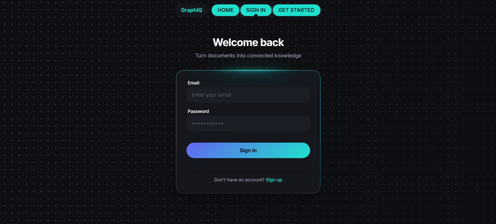
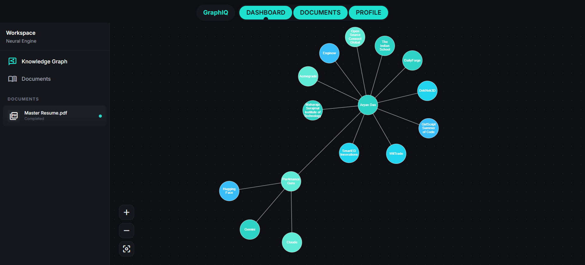
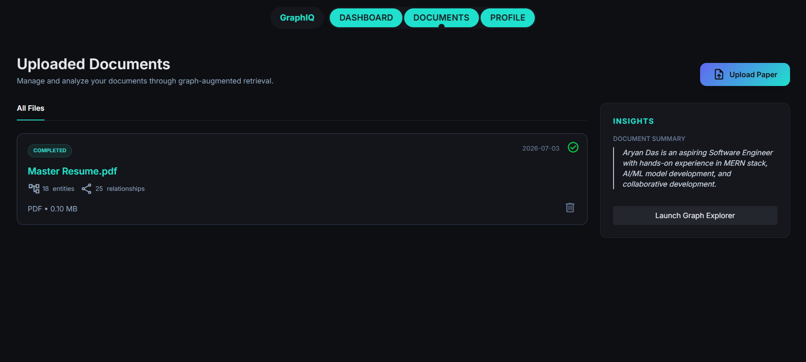
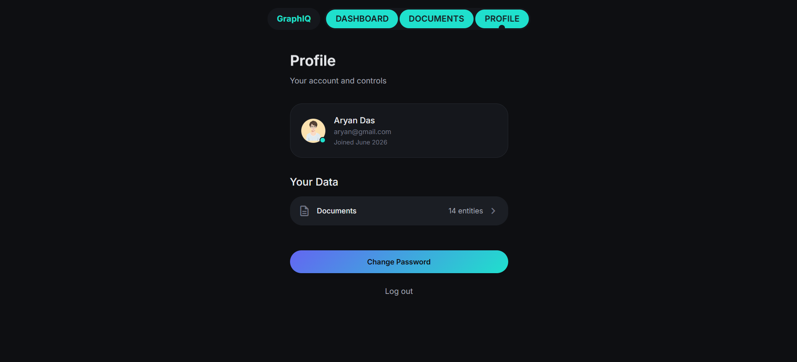

# GraphIQ

Turn documents into an interactive knowledge graph. Upload a PDF or DOCX, and GraphIQ extracts entities and relationships from it using an LLM, then lets you explore the result as a force-directed graph.

## Screenshots

| Landing Page | Sign In |
| --- | --- |
|  |  |

| Dashboard | Documents |
| --- | --- |
|  |  |

| Profile |
| --- |
|  |

## How it works

1. **Upload** — a PDF/DOCX is uploaded to Supabase Storage and a row is created in the `documents` table (`status: "uploaded"`).
2. **Process** — clicking "process" on a document triggers the backend pipeline:
   - Downloads the file from Storage and extracts raw text (`pdf-parse` for PDFs, `mammoth` for DOCX).
   - Generates a short summary, a list of named entities, and a list of relationships between those entities — all via Groq's LLM API.
   - Inserts the entities and relationships into their own Supabase tables, linked back to the source document.
   - Updates the document's `status` to `completed` (or `failed` if any step errors out).
3. **Explore** — the dashboard fetches entities/relationships for a selected document directly from Supabase and renders them as an interactive graph (`react-force-graph-2d`), with zoom/pan controls.

## Tech stack

**Frontend** (`frontend/`)
- React 19 + Vite
- Tailwind CSS v4
- React Router
- Supabase JS client (direct reads of `entities`/`relationships` for the graph view)
- `react-force-graph-2d` for graph rendering
- GSAP, `motion`, and a handful of React Bits components (`SplitText`, `ScrollReveal`, `BorderGlow`, `StarBorder`, `SpotlightCard`, `GlareHover`, `ClickSpark`, `AnimatedList`, `CountUp`, `PillNav`) for UI animation

**Backend** (`backend/`)
- Node.js + Express
- Supabase (Postgres + Storage), accessed via the service role key
- Groq SDK (`llama-3.1-8b-instant`) for summarization, entity extraction, and relationship extraction
- JWT-based auth (`jsonwebtoken`, `bcryptjs`)
- `multer` for file uploads, `pdf-parse` / `mammoth` for text extraction

## Project structure

```
backend/
  src/
    config/         # Supabase + Groq client setup
    controllers/     # Route handlers (auth, documents)
    middleware/       # Auth, file validation
    routes/          # Express routers
    utils/           # Text extraction, entity/relationship/summary extraction, Groq retry wrapper
  server.js

frontend/
  src/
    api/             # Axios wrappers for backend endpoints
    components/      # Shared UI components (including the React Bits integrations)
    context/          # AuthContext
    pages/           # LandingPage, Login, Signup, Dashboard, Documents, Profile
    routes/          # PrivateRoute wrapper
```

## Database schema

Four tables in Supabase/Postgres:

- **`users`** — id, name, email, password_hash, created_at
- **`documents`** — id, user_id (FK → users), file_name, file_url, file_type, file_size, status (`uploaded` / `processing` / `completed` / `failed`), summary, created_at
- **`entities`** — id, document_id (FK → documents, cascades on delete), name, created_at
- **`relationships`** — id, document_id (FK → documents, cascades), source_entity / target_entity (FK → entities, cascades), relation, created_at

## Local setup

### Backend

```bash
cd backend
npm install
```

Create `backend/.env`:

```
PORT=5000
URL=<your-supabase-project-url>
SERVICE_KEY=<your-supabase-service-role-key>
JWT_SECRET=<any-secret-string>
GROQ_API_KEY=<your-groq-api-key>
FRONTEND_URL=http://localhost:5173
```

```bash
npm run dev
```

### Frontend

```bash
cd frontend
npm install
```

Create `frontend/.env`:

```
VITE_BACKEND_URL=http://localhost:5000/api
VITE_SUPABASE_URL=<your-supabase-project-url>
VITE_SUPABASE_ANON_KEY=<your-supabase-anon-key>
```

```bash
npm run dev
```

Note: the frontend reads `entities`/`relationships` directly from Supabase using the anon key (not through the backend), so those two tables need a public `SELECT` policy in Supabase's Row Level Security settings.

## Deployment

- **Backend** → Render (or similar). Root directory `backend`, build `npm install`, start `npm start`. Set the same env vars as above (`PORT` is provided automatically by the host).
- **Frontend** → Vercel (or similar). Root directory `frontend`, auto-detected as Vite. Set `VITE_BACKEND_URL` to the deployed backend URL + `/api`, plus the two Supabase vars.

## API endpoints (backend)

**Auth** (`/api/auth`)
- `POST /signup`
- `POST /login`
- `GET /me` (requires auth)

**Documents** (`/api/documents`)
- `POST /upload` (requires auth, file upload)
- `GET /fetchDocuments` (requires auth) — list all documents for the current user, with entity/relationship counts
- `GET /fetchDocuments/:id` (requires auth) — single document details
- `DELETE /fetchDocuments/:id` (requires auth)
- `POST /fetchDocuments/:id/process` (requires auth) — runs the extraction pipeline
